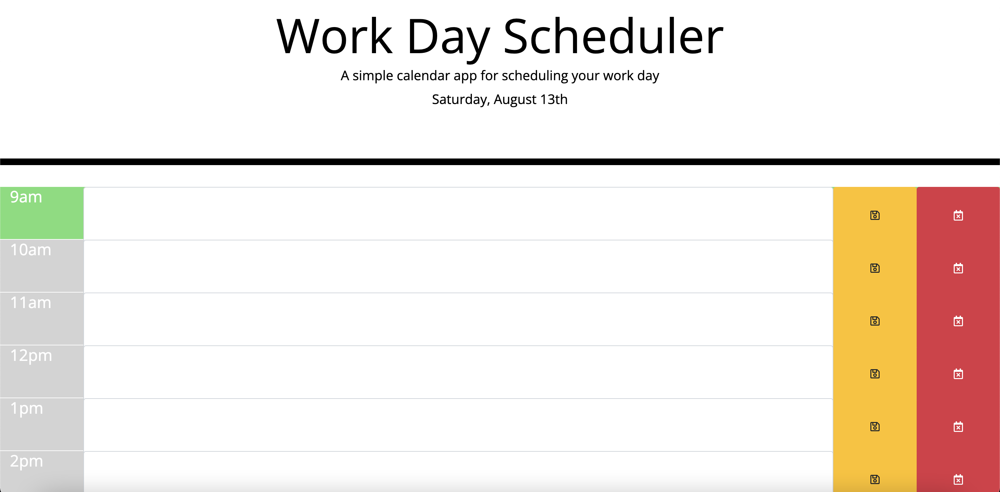

# M5-WorkDayScheduler

## Website screenshot 📸

## Deployed website link 🤖

https://leilabouk.github.io/M5-WorkDayScheduler/

## About this project 🐊

This project was created to meet the requirements of assignment 5. 

GIVEN I am using a daily planner to create a schedule
 
WHEN I open the planner
 
THEN the current day is displayed at the top of the calendar
 
WHEN I scroll down
 
THEN I am presented with time blocks for standard business hours
 
WHEN I view the time blocks for that day
 
THEN each time block is color-coded to indicate 
whether it is in the past, present, or future
 
WHEN I click into a time block
 
THEN I can enter an event
 
WHEN I click the save button for that time block
 
THEN the text for that event is saved in local storage
 
WHEN I refresh the page
 
THEN the saved events persist

## Languages 💬
HTML + CSS + JavaScript

## Technologies 🧩
Moment.js
 
jQuery
 
Bootstrap

## Usage 🐗

Use this page to plan your work day. Save and delete items on your schedule with the press of a button. Your saved items will persist in local storage.  
